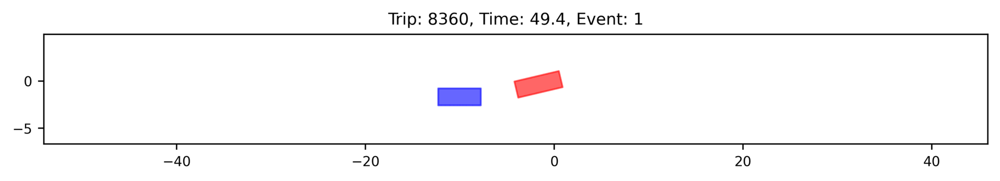
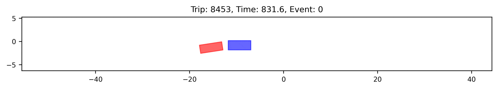
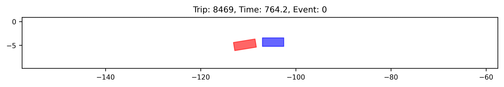
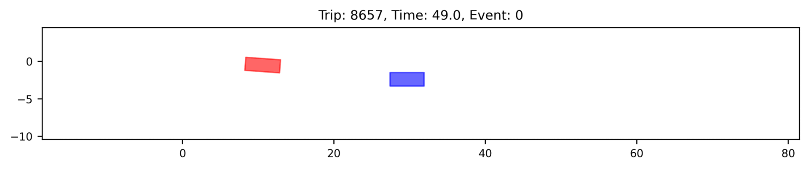
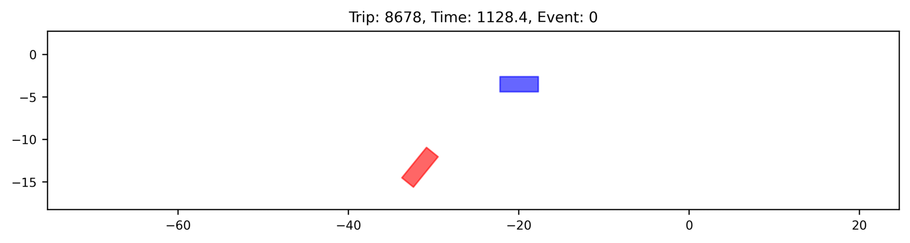
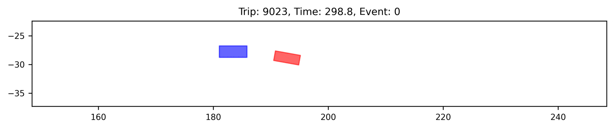

# Trajectory reconstruction of crashes and near-crashes from 100-Car NDS time-series data
This repository reconstructs bird's eye view trajectories of vehicles involved in crashes and near-crashes from 100-Car Naturalistic Driving Study (NDS) radar data.

## 100Car Naturalistic Driving Study (NDS)
>The 100-Car NDS was an instrumented-vehicle study conducted in the Northern Virginia / Washington, D.C. area over a 2 year period in early 2000s [^1]. The primary purpose of the study was to collect large scale naturalistic driving data. To this end, the instrumentation was designed to be unobtrusive, study participants were given no special instructions, and experimenters were not present. Approximately 100 vehicles were instrumented with a suite of sensors including forward and rearward radar, lateral and longitudinal accelerometers, gyro, GPS, access to the vehicle CAN, and five channels of compressed digital video. 
[^1]: Dingus, T.A., Klauer, S.G., Neale, V.L., Petersen, A., Lee, S.E., Sudweeks, J., Perez, M.A., Hankey, J., Ramsey, D., Gupta, S. and Bucher, C., 2006. The 100-car naturalistic driving study, Phase II-Results of the 100-car field experiment DOT-HS-810-593. United States. Department of Transportation. National Highway Traffic Safety Administration.

From the data collection, an event database has been compiled for 68 crashes and 760 near crashes, as defined in the table below [^2]. Note that 75% of the single vehicle crashes were low-g force physical contact or tire strikes; in other words, most of the crashes involved very minor physical contact. 
[^2]: Neale, V.L., Dingus, T.A., Klauer, S.G., Sudweeks, J. and Goodman, M., 2005. An overview of the 100-car naturalistic study and findings. National Highway Traffic Safety Administration, 05-0400.

|Event Category | Definition|
|---|---|
| Crash | Any contact between the subject vehicle and another vehicle, fixed object, pedestrian pedacyclist, or animal. |
| Near Crash | Defined as a conflict situation requiring a rapid, severe evasive maneuver to avoid a crash. |
| Incidents | Conflict requiring an evasive maneuver, but of lesser magnitude than a near crash. |

Including time-series sensor data, event context narratives, and manually remarked descriptions of these events, this database is now made public [^3] under a license of CC0 1.0. The time-series profile for each event contains radar and accelerometer data spanning 30s before the event and 10s after the event. This allows for trajectory reconstruction for the vehicles involved in the events.
[^3]: Custer, K., 2018. 100-Car data. VITTI. https://doi.org/10.15787/VTT1/CEU6RB

## Reconstructed examples of crashes
Not all of the events can be reconstructed due to the missing values, inaccuracy of sensing, and the lack of a ground truth. Subsequently, matching the target vehicle among the detected vehicles in each event is neither trivial. In this repository, 9 crashes and 128 near-crashes are matched based on the restriction that there is not sufficient space for a undetected vehicle. The following examples visualise the 9 reconstructed and matched crashes.









## To repeat/adjust the processing
### Python libarary requirements
`pandas`, `tqdm`, `numpy`, `matplotlib`

### Workflow
Use function `TTC(samples, 'dataframe')` or `TTC(samples, 'values')` to compute two-dimensional Time-To-Collision.

For example,
````python   
import sys
sys.path.append('') # add the path where you save this `.py` file
import TwoDimTTC

# To return a dataframe with the input vehicle pair samples, where 2D-TTC are saved in a new column named 'TTC'
samples = TwoDimTTC.TTC(samples, 'dataframe')

# To return a numpy array of 2D-TTC values
ttc = TwoDimTTC.TTC(samples, 'values')
````
## Input
The first input is a pandas dataframe of vehicle pair samples, which should include the following columns.
- `x_i`      :  x coordinate of the ego vehicle $i$ (usually assumed to be centroid)
- `y_i`      :  y coordinate of the ego vehicle $i$ (usually assumed to be centroid)
- `vx_i`     :  x coordinate of the velocity of the ego vehicle $i$
- `vy_i`     :  y coordinate of the velocity of the ego vehicle $i$
- `hx_i`     :  x coordinate of the heading direction of the ego vehicle $i$
- `hy_i`     :  y coordinate of the heading direction of the ego vehicle $i$
- `length_i` :  length of the ego vehicle $i$
- `width_i`  :  width of the ego vehicle $i$
- `x_j`      :  x coordinate of another vehicle $j$ (usually assumed to be centroid)
- `y_j`      :  y coordinate of another vehicle $j$ (usually assumed to be centroid)
- `vx_j`     :  x coordinate of the velocity of another vehicle $j$
- `vy_j`     :  y coordinate of the velocity of another vehicle $j$
- `hx_j`     :  x coordinate of the heading direction of another vehicle $j$
- `hy_j`     :  y coordinate of the heading direction of another vehicle $j$
- `length_j` :  length of another vehicle $j$
- `width_j`  :  width of another vehicle $j$

The second input allows outputing a dataframe with inputed samples plus a new column named 'TTC', or mere TTC values.

## Output
If `ttc==np.inf`, the ego vehicle $i$ and another vehicle $j$ will never collide if they keep current speed.

A negative TTC means the boxes of the ego vehicle $i$ and another vehicle $j$ are overlapping. This is due to approximating the space occupied by a vehicle with a rectangular. In other words, `ttc<0` in this computation means the collision between the two vehicles almost (or although seldom, already) occurred.

Note that mere TTC computation can give an extreme small positive value even when the vehivles are overlapping a bit. In order to improve the accuracy, please use function `CurrentD(samples, 'dataframe')` or `CurrentD(samples, 'values')` to further exclude overlapping vehicles. This function calculate current distance between the ego vehicle $i$ and another vehicle $j$, which indicate overlapping when the value is negative.

````python   
# Within pandas dataframe
samples = TwoDimTTC.TTC(samples, 'dataframe')
samples = TwoDimTTC.CurrentD(samples, 'dataframe')
samples.loc[(samples.CurrentD<0)&(samples.TTC<np.inf)&(samples.TTC>0),'TTC'] = -1

# Using numpy array of values
ttc = TwoDimTTC.TTC(samples, 'values')
current_dist = TwoDimTTC.CurrentD(samples, 'values')
ttc[(current_dist<0)&(ttc<np.inf)&(ttc>0)] = -1
````

## Efficiency
Use function `efficiency(samples, iterations)` to test the computation efficiency.

For example,
````python   
print('Average time cost = {:.4f} second(s)'.format(TwoDimTTC.efficiency(samples, 10)
````

The following table shows approximately needed computation time (tested for 10 iterations of experiments).
| number of vehicle pairs | computation time (s)|
|-------|-------|
| 1e4 | 0.0357 |
| 1e5 | 0.4342 |
| 1e6 | 7.1657 |

## Copyright
Copyright (c) 2022 Yiru Jiao. All rights reserved.

This work is licensed under the terms of the MIT license. For a copy, see <https://opensource.org/licenses/MIT>.
